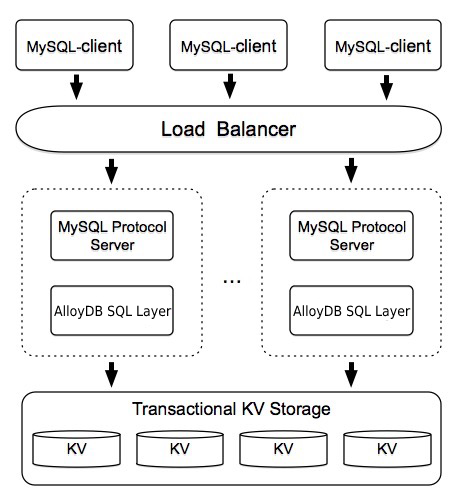

[](https://travis-ci.org/Dong-Chan/alloydb
)
## What is AlloyDB?

AlloyDB is a distributed SQL database.
Inspired by the design of Google [F1](http://research.google.com/pubs/pub41344.html), AlloyDB supports the best features of both traditional RDBMS and NoSQL.

- __Horizontal scalability__  
Grow AlloyDB as your business grows. You can increase the capacity simply by adding more machines.

- __Asynchronous schema changes__  
Evolve AlloyDB schemas as your requirement evolves. You can add new columns and indices without stopping or affecting the on-going operations.

- __Consistent distributed transactions__  
Think of AlloyDB as a single-machine RDBMS. You can start a transaction that executes across multiple machines without worrying about consistency. AlloyDB makes your application code simple and robust.

- __Compatible with MySQL protocol__  
Use AlloyDB as MySQL. You can replace MySQL with AlloyDB to power your application without changing a single line of code in most cases.

- __Written in Go__  
Enjoy AlloyDB as much as we love Go. We believe Go code is both easy and enjoyable to work with. Go helps us improve AlloyDB quickly and makes it easy to dive into the codebase.

- __Multiple storage engine support__  
Power AlloyDB with your most favorite engines. AlloyDB supports most of the popular storage engines in single-machine mode. You can choose from goleveldb, LevelDB, RocksDB, LMDB, BoltDB and even more to come.

## Status

AlloyDB is at its early age and under heavy development, some of the features mentioned above have not been fully implemented.

__Please do not use it in production.__

## Roadmap

Read the [Roadmap](./ROADMAP.md).

## Quick start

- __Pre-requirement__  
```
go get -d github.com/Dong-Chan/alloydb
cd $GOPATH/src/github.com/Dong-Chan/alloydb
make
```

- __Run command line interpreter__

Interpreter is an interactive command line AlloyDB client.
You can just enter some SQL statements and get the result.
```
make interpreter
cd interpreter && ./interpreter
```
Press `Ctrl+C` to quit.

- __Run as go library__  
See [USAGE.md](./docs/USAGE.md) for detailed instructions to use AlloyDB as library in Go code.

- __Run as MySQL protocol server with single-machine KV storage engine__  
Comming soon.

- __Run as MySQL protocol server with distributed transactional KV storage engine__  
Comming soon.

## Architecture



## Contributing
Contributions are welcomed and greatly appreciated. See [CONTRIBUTING.md](./docs/CONTRIBUTING.md)
for details on submitting patches and the contribution workflow.

## Follow us

Author Email: tomyyear@gmail.com

## License
AlloyDB is under the Apache 2.0 license. See the [LICENSE](./LICENSE.md) file for details.

## Acknowledgments
- Thanks [cznic](https://github.com/cznic) for providing some great open source tools.
- Thanks [GolevelDB](https://github.com/syndtr/goleveldb), [LMDB](https://github.com/LMDB/lmdb), [BoltDB](https://github.com/boltdb/bolt) and [RocksDB](https://github.com/facebook/rocksdb) for their powerful storage engines.
